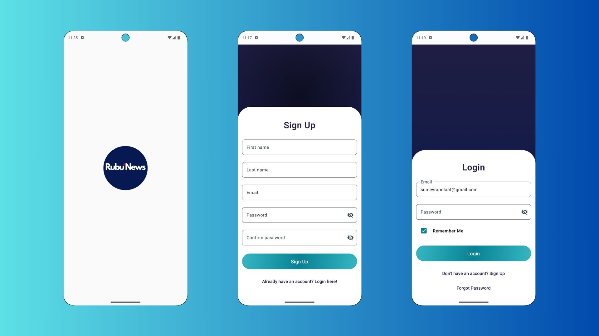
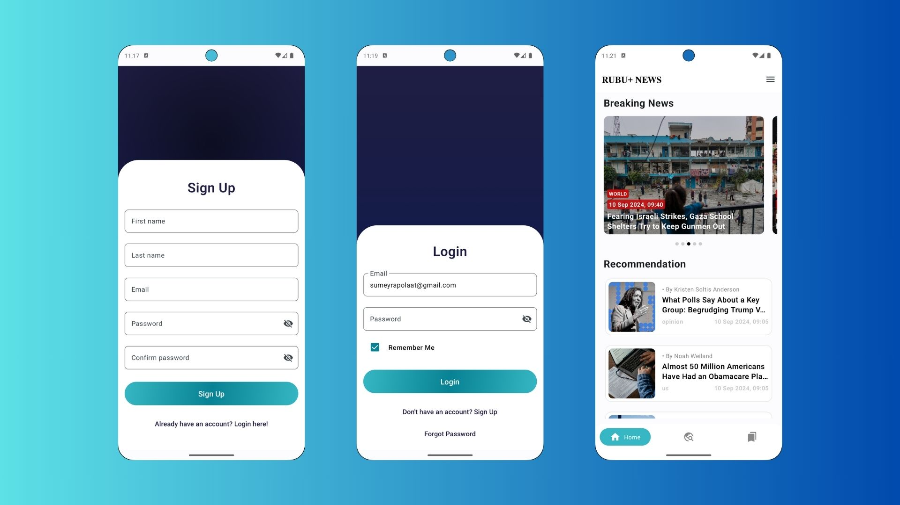
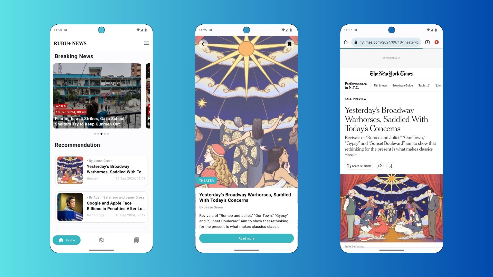
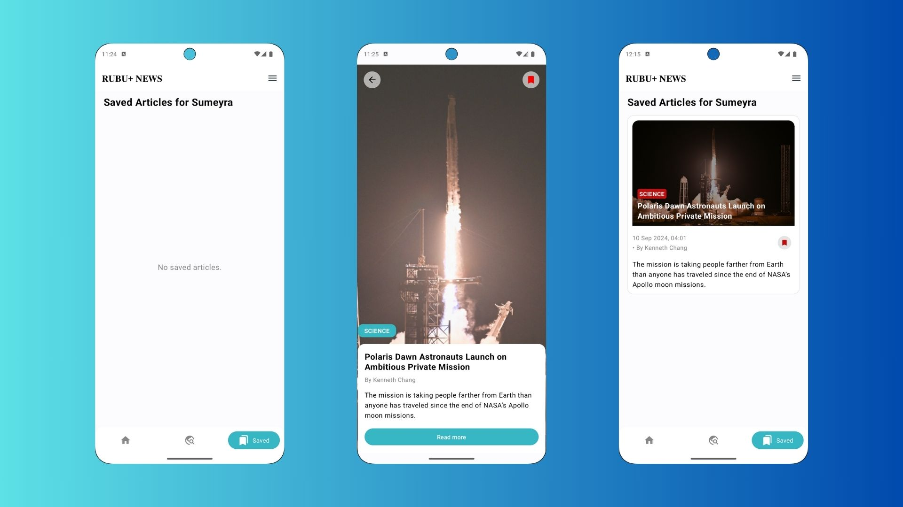
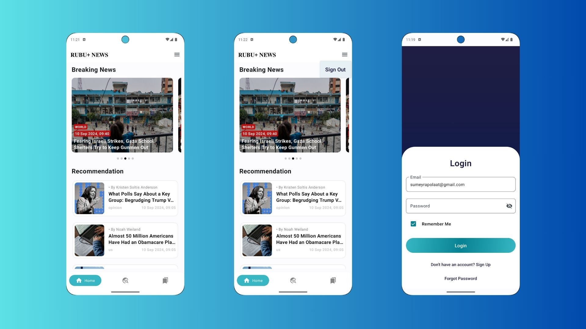
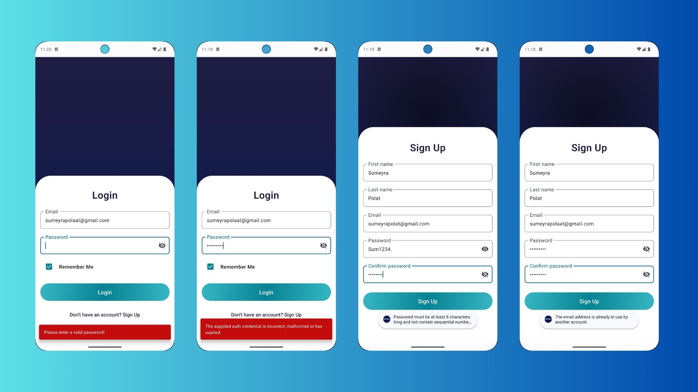
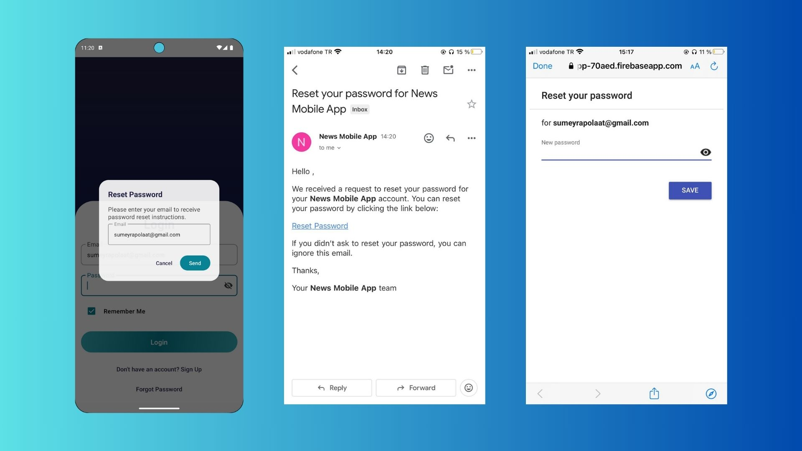

# RubuPlus Android Test Case

Rubu+News, kullanıcıların e-posta ve şifre ile giriş yapmasını sağlar, haberleri listeleyip, detaylarına erişmelerine olanak tanır. Ayrıca kullanıcılar, haberleri favorilerine ekleyebilir ve favori haberlerini görebilirler. Uygulama, **New York Times Top Stories** ve **Article Search** API'larını kullanarak en güncel haberleri sunmaktadır.

## Özellikler:
- Kullanıcı girişi (Email ve Şifre)
- Şifre yenileme fonksiyonu (Şifremi Unuttum)
- "Beni Hatırla" özelliği ile otomatik giriş
- Kullanıcı kayıt işlemi
- Haber listesi ve detay ekranı
- Haberleri favorilere ekleme ve favoriler ekranı
- Kategoriye göre haber filtreleme
- Haber arama fonksiyonu
- Gelişmiş API ve log yönetimi

## Kurulum:
1. Projeyi klonlayın:
   ```bash
   git clone https://github.com/your-repository/RubuPlusAndroidTestCase.git
2. Android Studio ile projeyi açın.
3. Gerekli bağımlılıkları indirmek için proje yapılandırmasını senkronize edin.
4. Uygulamayı Android cihazınızda ya da emülatörde çalıştırın.

## Kullanım:
- Uygulama açıldığında kullanıcı bir giriş ekranı ile karşılaşır.
- Kullanıcı, e-posta ve şifre bilgileri ile giriş yapabilir veya şifresini unuttuysa "Şifremi Unuttum" bağlantısı üzerinden şifresini yenileyebilir.
- "Beni Hatırla" özelliği ile kullanıcı bir sonraki girişinde otomatik tanınır.
- Kayıtlı değilse, yeni hesap oluşturabilir ve giriş yapabilir.
- Ana ekranda New York Times'tan çekilen haberler listelenir.
- Kategoriler ekranında, kullanıcı haberleri farklı kategorilere göre filtreleyebilir.
- Kullanıcı haber detayına tıklayarak daha fazla bilgi alabilir ve haberi favorilere ekleyebilir.
- Favorilere eklenen haberler favoriler ekranında gösterilir.
- Kullanıcı aynı zamanda haber arama fonksiyonunu kullanarak makale araması yapabilir.
- Haberin tamamını görüntülemek isterse Read More butonuna tıklayarak cihazdaki varsayılan tarayıcı ile haberin sitesine ulaşabilir.

## Ekran Görüntüleri:
Aşağıda uygulamanın bazı ekran görüntülerini bulabilirsiniz:

## Ekran Görüntüleri:

### 1. Signup ve Login Ekranları:


### 2. Login ve Feed Ekranı:


### 3. Feed ve Read More Ekranı:


### 4. Kategori, Arama ve Detay Ekranı:


### 5. Detay ve Favoriler Ekranı:


### 6. Feed ve Sign Out, Login Ekranları:


### 7. Kontrol Ekranları:


### 8. Şifre Sıfırlama Ekranı:


## Kullanılan Teknolojiler:
- **Kotlin**: Android geliştirme dili
- **MVVM Mimarisi**: Projenin temel mimarisi
- **Retrofit**: API istekleri için
- **Dagger Hilt**: Bağımlılık enjeksiyonu için
- **Firebase Authentication**: Kullanıcı girişi ve kaydı için
- **Firebase Storage**: Kullanıcı bilgilerini tutmak için
- **New York Times API**: Haberler ve makaleler için
  
## API İyileştirmeleri:
- Uygulama iki farklı **New York Times API'sini** kullanmaktadır: **Top Stories** ve **Article Search**.
- API isteklerinde başarı durumları ve hata yönetimi iyileştirilmiştir.
- **Retrofit** kullanılarak API istekleri yönetilmiş ve her iki API için `buildConfigField` kullanılarak API anahtarı güvenli bir şekilde yapılandırılmıştır.
- **SerializedName** etiketleri kullanılarak, API modelleri ile JSON veri formatları arasında uyum sağlanmış, veri çekerken karşılaşılabilecek sorunlar önlenmiştir.
- Proguard konfigürasyonu yapılarak API anahtarlarının gizliliği korunmuştur.

### Yapılan İyileştirmeler:
- API anahtarlarının **buildConfigField** ile yönetimi ve `proguard-rules.pro` dosyası ile log mesajlarının kaldırılması sağlandı.
- API isteklerinde başarı durumu ve hata yönetimi iyileştirildi.
- Tüm loglar, Proguard ile üretim (release) sürümünde devre dışı bırakıldı.

## Lisans:
Bu proje MIT Lisansı ile lisanslanmıştır.

-----------------------------------------------------------------------------------------------------------------------------------------------------------------------------
