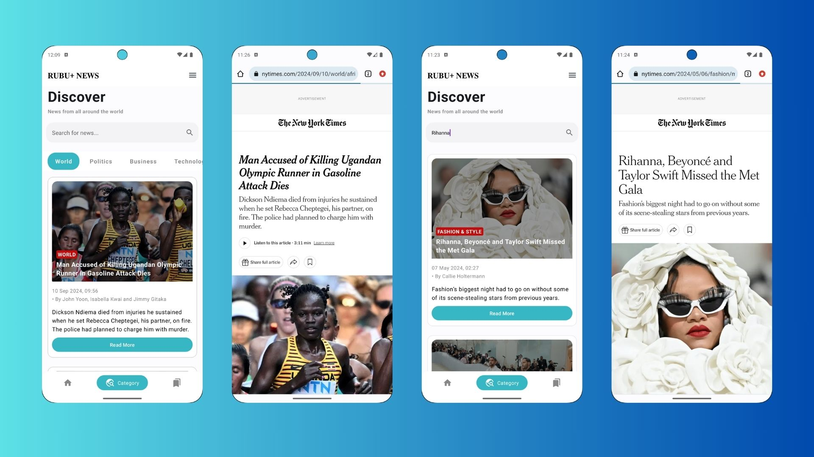

# RubuPlus Android Test Case

Rubu+News, kullanıcıların e-posta ve şifre ile giriş yapmasını sağlar, haberleri listeleyip, detaylarına erişmelerine olanak tanır. Ayrıca kullanıcılar, haberleri favorilerine ekleyebilir ve favori haberlerini görebilirler. Uygulama, **New York Times Top Stories** ve **Article Search** API'larını kullanarak en güncel haberleri sunmaktadır.

## Özellikler:
- Kullanıcı girişi (Email ve Şifre)
- Şifre yenileme fonksiyonu (Şifremi Unuttum)
- "Beni Hatırla" özelliği ile otomatik giriş
- Kullanıcı kayıt işlemi
- Haber listesi ve detay ekranı
- Haberleri favorilere ekleme ve favoriler ekranı
- Kategoriye göre haber filtreleme
- Haber arama fonksiyonu
- Gelişmiş API ve log yönetimi

## Kurulum:
1. Projeyi klonlayın:
   ```bash
   git clone https://github.com/your-repository/RubuPlusAndroidTestCase.git
2. Android Studio ile projeyi açın.
3. Gerekli bağımlılıkları indirmek için proje yapılandırmasını senkronize edin.
4. Uygulamayı Android cihazınızda ya da emülatörde çalıştırın.

## Kullanım:
- Uygulama açıldığında kullanıcı bir giriş ekranı ile karşılaşır.
- Kullanıcı, e-posta ve şifre bilgileri ile giriş yapabilir veya şifresini unuttuysa "Şifremi Unuttum" bağlantısı üzerinden şifresini yenileyebilir.
- "Beni Hatırla" özelliği ile kullanıcı bir sonraki girişinde otomatik tanınır.
- Kayıtlı değilse, yeni hesap oluşturabilir ve giriş yapabilir.
- Ana ekranda New York Times'tan çekilen haberler listelenir.
- Kategoriler ekranında, kullanıcı haberleri farklı kategorilere göre filtreleyebilir.
- Kullanıcı haber detayına tıklayarak daha fazla bilgi alabilir ve haberi favorilere ekleyebilir.
- Favorilere eklenen haberler favoriler ekranında gösterilir.
- Kullanıcı aynı zamanda haber arama fonksiyonunu kullanarak makale araması yapabilir.
- Haberin tamamını görüntülemek isterse Read More butonuna tıklayarak cihazdaki varsayılan tarayıcı ile haberin sitesine ulaşabilir.

## Ekran Görüntüleri:
Aşağıda uygulamanın bazı ekran görüntülerini bulabilirsiniz:

### 1. Signup ve Login Ekranları:


### 2. Login ve Feed Ekranı:


### 3. Feed ve Read More Ekranı:


### 4. Kategori, Arama ve Detay Ekranı:


### 5. Detay ve Favoriler Ekranı:


### 6. Feed ve Sign Out, Login Ekranları:


### 7. Kontrol Ekranları:


### 8. Şifre Sıfırlama Ekranı:


## Kullanılan Teknolojiler:
- **Kotlin**: Android geliştirme dili
- **MVVM Mimarisi**: Projenin temel mimarisi
- **Retrofit**: API istekleri için
- **Dagger Hilt**: Bağımlılık enjeksiyonu için
- **Firebase Authentication**: Kullanıcı girişi ve kaydı için
- **Firebase Storage**: Kullanıcı bilgilerini tutmak için
- **New York Times API**: Haberler ve makaleler için
  
## API İyileştirmeleri:
- Uygulama iki farklı **New York Times API'sini** kullanmaktadır: **Top Stories** ve **Article Search**.
- API isteklerinde başarı durumları ve hata yönetimi iyileştirilmiştir.
- **Retrofit** kullanılarak API istekleri yönetilmiş ve her iki API için `buildConfigField` kullanılarak API anahtarı güvenli bir şekilde yapılandırılmıştır.
- **SerializedName** etiketleri kullanılarak, API modelleri ile JSON veri formatları arasında uyum sağlanmış, veri çekerken karşılaşılabilecek sorunlar önlenmiştir.
- Proguard konfigürasyonu yapılarak API anahtarlarının gizliliği korunmuştur.

### Yapılan İyileştirmeler:
- API anahtarlarının **buildConfigField** ile yönetimi ve `proguard-rules.pro` dosyası ile log mesajlarının kaldırılması sağlandı.
- API isteklerinde başarı durumu ve hata yönetimi iyileştirildi.
- Tüm loglar, Proguard ile üretim (release) sürümünde devre dışı bırakıldı.

## Lisans:
Bu proje MIT Lisansı ile lisanslanmıştır.

-----------------------------------------------------------------------------------------------------------------------------------------------------------------------------
# RubuPlus Android Test Case

Rubu+News allows users to log in with email and password, list news articles, and access detailed news content. Users can also add news articles to their favorites and view their favorite news. The app uses the **New York Times Top Stories** and **Article Search** APIs to provide the latest news.

## Features:
- User login (Email and Password)
- Password reset function (Forgot Password)
- "Remember Me" feature for automatic login
- User registration
- News list and detail screens
- Add news articles to favorites and view them in the favorites screen
- Filter news by category
- News search function
- Advanced API and log management

  ## Setup:
1. Clone the project:
   ```bash
   git clone https://github.com/your-repository/RubuPlusAndroidTestCase.git
2. Open the project in Android Studio.
3. Sync the project to download the required dependencies.
4. Run the application on an Android device or emulator.

## Usage:
- Upon opening the app, the user is greeted with a login screen.
- The user can log in with their email and password or reset their password using the "Forgot Password" link if needed.
- The "Remember Me" feature allows the user to be automatically recognized on subsequent logins.
- If not registered, the user can create a new account and log in.
- On the main screen, news fetched from the New York Times is listed.
- In the categories screen, the user can filter news by various categories.
- By clicking on a news item, the user can view more details and add the article to their favorites.
- News added to favorites will be displayed in the favorites screen.
- Users can also utilize the search function to look for specific articles.
- To read the full article, the user can click the Read More button, which opens the news site in the device's default browser.

## Screenshots:
Below are some screenshots of the application:

### 1. Signup and Login Screens:


### 2. Login and Feed Screens:


### 3. Feed and Read More Screen:


### 4. Category, Search, and Detail Screen:


### 5. Detail and Favorites Screen:


### 6. Feed and Sign Out, Login Screens:


### 7. Control Screens:


### 8. Password Reset Screen:


## Technologies Used:
- **Kotlin**: Programming language for Android development
- **MVVM Architecture**: Core architecture of the project
- **Retrofit**: For handling API requests
- **Dagger Hilt**: For dependency injection
- **Firebase Authentication**: For user login and registration
- **Firebase Storage**: To store user data
- **New York Times API**: For news articles

## API Enhancements:
- The application uses two different **New York Times APIs**: **Top Stories** and **Article Search**.
- Error handling and success states have been improved for API requests.
- **Retrofit** has been used to manage API requests, and API keys are securely handled using `buildConfigField` for both APIs.
- **SerializedName** annotations ensure compatibility between API models and JSON data formats, preventing issues when fetching data.
- The Proguard configuration has been set up to protect API keys and remove log messages.

### Improvements Made:
- Managed API keys using **buildConfigField** and set up `proguard-rules.pro` to remove log messages.
- Enhanced error handling and success states for API requests.
- All logs are disabled in the release build using Proguard.

## License:
This project is licensed under the MIT License.
